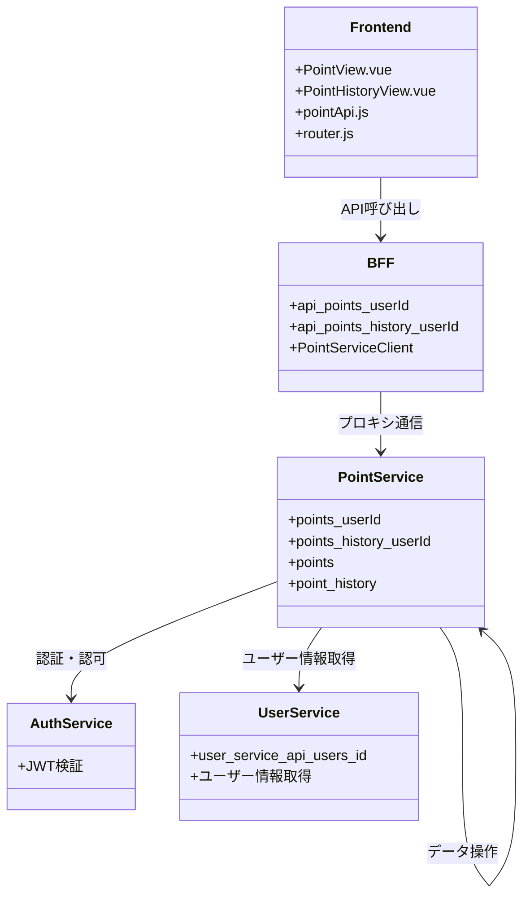

# ポイント管理機能のクラス図

以下は、ポイント管理機能の追加に伴うクラス図です。

```mermaid
classDiagram
    class Frontend {
        +PointView.vue
        +PointHistoryView.vue
        +pointApi.js
        +router.js
    }
    class BFF {
        +api_points_userId
        +api_points_history_userId
        +PointServiceClient
    }
    class PointService {
        +points_userId
        +points_history_userId
        +points
        +point_history
    }
    class AuthService {
        +JWT検証
    }
    class UserService {
        +user_service_api_users_id
        +ユーザー情報取得
    }

    Frontend --> BFF : API呼び出し
    BFF --> PointService : プロキシ通信
    PointService --> AuthService : 認証・認可
    PointService --> UserService : ユーザー情報取得
    PointService --> PointService : データ操作
```
