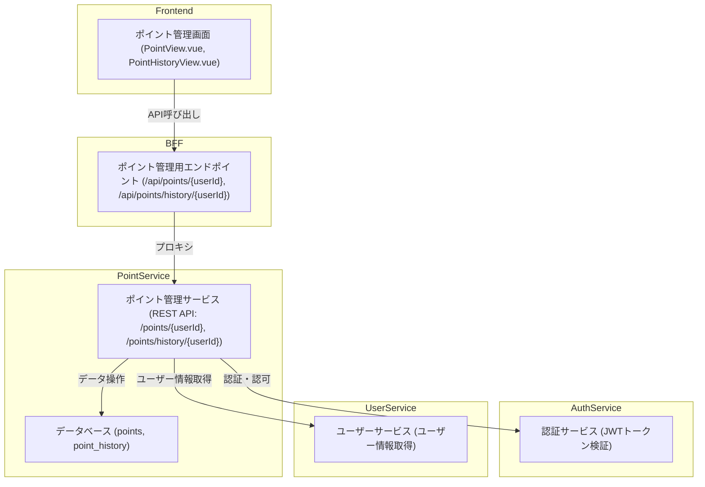

# ポイント管理機能のデータフロー

## データフロー図

---

## 既存箇所と変更箇所

### 既存箇所
1. **Frontend**
   - `frontend/src/` 以下に既存のVue.jsアプリケーションが存在。
2. **BFF**
   - `bff` サービスに既存のエンドポイントが存在。
3. **AuthService**
   - `auth-service` に認証・認可機能が存在。
4. **UserService**
   - `user-service` にユーザー情報取得機能が存在。

---

### 変更箇所
1. **Frontend**
   - 新しいビューを追加。
     - `PointView.vue`: ポイント残高表示画面。
     - `PointHistoryView.vue`: ポイント履歴表示画面。
   - API呼び出し用のサービス (`pointApi.js`) を追加。
   - ルーティング (`router.js`) を更新。

2. **BFF**
   - ポイント管理用の新しいエンドポイントを追加。
     - `/api/points/{userId}`: ポイント残高取得。
     - `/api/points/history/{userId}`: ポイント履歴取得。
   - ポイント管理サービスへのプロキシを実装。

3. **PointService**
   - 新しいマイクロサービスを作成。
     - REST API:
       - `GET /points/{userId}`: ポイント残高取得。
       - `GET /points/history/{userId}`: ポイント履歴取得。
       - `POST /points/register`: ポイント登録（内部向けAPI）。
       - `POST /points/use`: ポイント利用（内部向けAPI、UI画面からの利用は不要）。
     - データベーススキーマ:
       - `points`: ユーザーのポイント残高を管理。
       - `point_history`: ポイント履歴を管理。
     - ポイントの仕様:
       - ポイントの単位は `pt`。
       - ポイントは半年で失効（失効予定日のみDB管理し、有効/失効判定はビジネスロジックで制御）。

4. **AuthService**
   - JWTトークンの検証をポイント管理サービスに統合。

5. **UserService**
   - ユーザー情報取得のための連携をポイント管理サービスに実装。

---

## 変更箇所の解説

### Frontend
- **目的**: ユーザーがポイント残高や履歴を確認できる画面を提供。
- **変更内容**: 新しいビューとAPI呼び出しロジックを追加。

### BFF
- **目的**: フロントエンドとポイント管理サービスをつなぐ役割を果たす。
- **変更内容**: ポイント管理用のエンドポイントを追加し、プロキシを実装。

### PointService
- **目的**: ポイント管理機能を独立したマイクロサービスとして提供。
- **変更内容**: REST APIとデータベーススキーマを新規作成。

### AuthService
- **目的**: ポイント管理サービスが認証・認可を行えるようにする。
- **変更内容**: JWTトークンの検証を実装。

### UserService
- **目的**: ポイント管理サービスがユーザー情報を取得できるようにする。
- **変更内容**: 必要に応じて新しいエンドポイントを追加。

---

以上の変更を実施することで、ポイント管理機能を実現可能です。