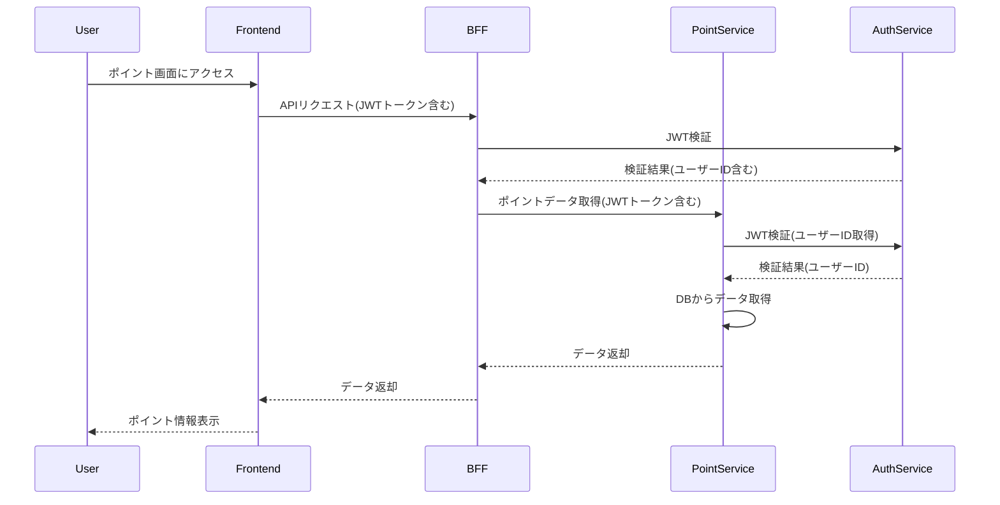

# アプリケーション利用プロセス（シーケンス図）

以下は、ポイント管理機能の利用プロセスを示すシーケンス図です。

## 認証フローの詳細
- **BFF**: JWTトークンを検証し、リクエストの正当性を確認。
- **PointService**: JWTトークンからユーザーID（UUID形式）を取得し、リクエストパラメータにユーザー情報を含めずにDBアクセスを実施。
- **JWT構造**: JWTペイロードには `userId` クレーム（UUID形式）が必須。
