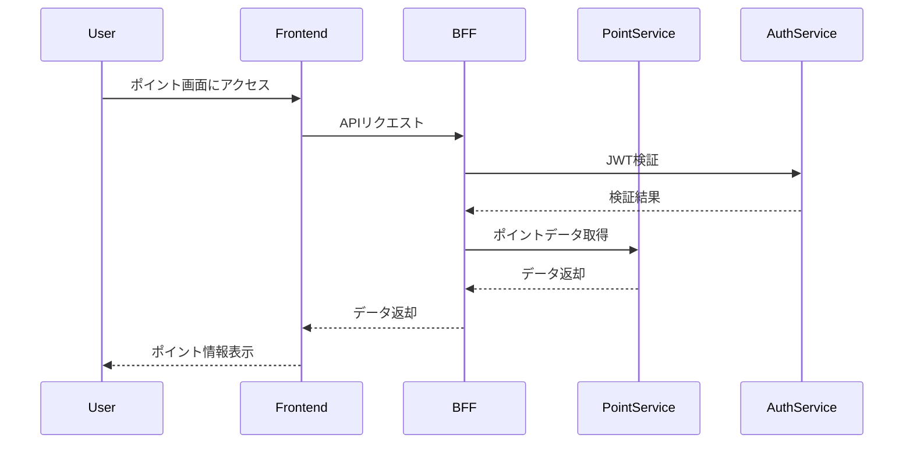

# アプリケーション利用プロセス（シーケンス図）

以下は、ポイント管理機能の利用プロセスを示すシーケンス図です。

```mermaid
sequenceDiagram
    participant User
    participant Frontend
    participant BFF
    participant PointService
    participant AuthService

    User ->> Frontend: ポイント画面にアクセス
    Frontend ->> BFF: APIリクエスト
    BFF ->> AuthService: JWT検証
    AuthService -->> BFF: 検証結果
    BFF ->> PointService: ポイントデータ取得
    PointService -->> BFF: データ返却
    BFF -->> Frontend: データ返却
    Frontend -->> User: ポイント情報表示
```