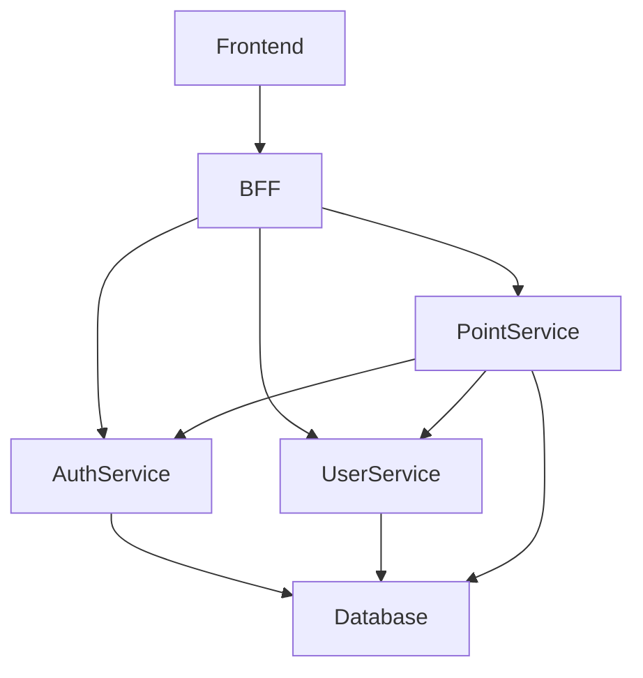

# アプリケーション概要と依存関係

## アプリケーション概要

### auth-service
- **機能**: 認証と認可を担当。
- **依存関係**: データベース、他のマイクロサービス。
- **使用技術**: Java, Maven, GlassFish。

### bff (Backend for Frontend)
- **機能**: フロントエンドとバックエンド間の通信を仲介。
- **依存関係**: 各マイクロサービス。
- **使用技術**: Java, Maven, Payara。

### user-service
- **機能**: ユーザー管理を担当。
- **依存関係**: データベース、他のマイクロサービス。
- **使用技術**: Java, Maven, GlassFish。

### frontend
- **機能**: ユーザーインターフェースを提供。
  - ポイント残高や履歴を表示。
- **依存関係**: BFF。
- **使用技術**: Vue.js, Vite, TailwindCSS, Axios。

### point-service (新規)
- **機能**: ポイント管理を担当。
- **依存関係**: データベース、`auth-service`、`user-service`。
- **使用技術**: Java, Maven, REST API。

---

## 依存関係マップ

